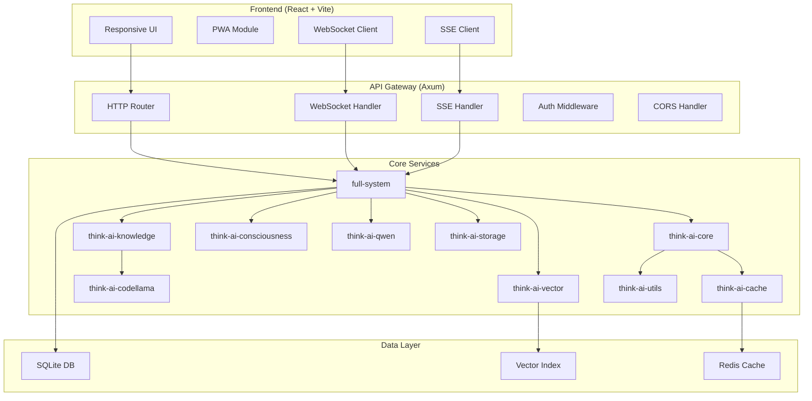
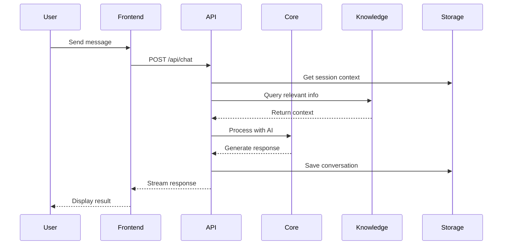

# System Architecture

The Think AI system is a modern full-stack application combining a high-performance Rust backend with a responsive React frontend. The system provides advanced AI capabilities through a modular architecture designed for scalability and extensibility.

## System Overview

The Think AI architecture consists of three main layers:

1. **Frontend Layer**: React-based responsive UI with PWA capabilities
2. **Backend Layer**: Rust-based API server with WebSocket and SSE support
3. **Core AI Layer**: Modular Rust crates providing AI functionality

## Core Components

The system is built around several key architectural principles:

*   **O(1) Performance:** Core components utilize constant-time algorithms for optimal scalability
*   **Knowledge Transfer:** Sophisticated knowledge management with vector embeddings and semantic search
*   **Modular Design:** Microservice-inspired crate architecture for maintainability
*   **Real-time Communication:** WebSocket and Server-Sent Events for streaming responses
*   **Session Persistence:** SQLite-based session storage with eternal memory capabilities
*   **Responsive Design:** Mobile-first UI that adapts to all screen sizes

## System Architecture Diagram

## Frontend Architecture

The frontend is built with modern web technologies:

- **React 19**: Latest React with concurrent features
- **Vite**: Fast build tool with HMR support
- **PWA**: Progressive Web App with offline capabilities
- **Responsive Design**: Mobile-first approach with CSS Grid/Flexbox
- **State Management**: React hooks with context for global state
- **Real-time Updates**: WebSocket and SSE integration

### Key Frontend Features

1. **Adaptive UI**: Automatically adjusts layout for mobile/tablet/desktop
2. **Code Highlighting**: Syntax highlighting for programming discussions
3. **Session Management**: Persistent conversations across page reloads
4. **Feature Toggles**: Web search and fact-checking capabilities
5. **Copy Functionality**: One-click message copying
6. **Loading States**: Smooth loading animations and skeleton screens

## Backend Architecture

The backend leverages Rust's performance and safety:

### API Endpoints

- `GET /health` - Basic health check
- `GET /api/health` - Detailed service status
- `POST /api/chat` - Main chat endpoint
- `GET /api/chat/sessions` - List all sessions
- `GET /api/chat/sessions/:id` - Get specific session
- `WS /ws/chat` - WebSocket endpoint
- `GET /api/chat/stream` - SSE streaming endpoint
- `GET /api/consciousness/level` - Consciousness metrics
- `GET /api/knowledge/stats` - System statistics

### Core Crates

1. **think-ai-core**: Core engine with O(1) algorithms
2. **think-ai-knowledge**: Knowledge graph and retrieval
3. **think-ai-consciousness**: Self-awareness framework
4. **think-ai-vector**: Vector embeddings and similarity search
5. **think-ai-qwen**: Qwen model integration
6. **think-ai-storage**: Persistent storage management
7. **think-ai-cache**: High-performance caching layer
8. **think-ai-utils**: Shared utilities and helpers

## Data Flow

## Testing Architecture

Comprehensive testing infrastructure ensures reliability:

### Test Pyramid

1. **Unit Tests** (Base)
   - Rust: 100% coverage with mockall
   - React: Component tests with React Testing Library
   
2. **Integration Tests** (Middle)
   - API endpoint testing
   - Frontend integration with MSW
   - Database integration tests
   
3. **E2E Tests** (Top)
   - Playwright for cross-browser testing
   - User journey validation
   - Performance testing

### Testing Infrastructure

- **Pre-commit Hooks**: Automated quality checks
- **CI/CD Pipeline**: GitHub Actions workflow
- **Coverage Reporting**: HTML dashboards with metrics
- **Periodic Testing**: Background test runner service

## Performance Optimizations

1. **Frontend**
   - Code splitting with dynamic imports
   - Lazy loading for components
   - Vite's build optimization
   - Service Worker caching
   
2. **Backend**
   - O(1) algorithms in hot paths
   - Connection pooling
   - Async/await throughout
   - Efficient serialization
   
3. **Caching**
   - Response caching
   - Session caching
   - Static asset caching
   - Vector embedding cache

## Security Architecture

- **CORS**: Configurable origin control
- **Rate Limiting**: Token bucket algorithm
- **Input Validation**: Comprehensive sanitization
- **HTTPS**: Enforced in production
- **Session Security**: Secure session tokens
- **XSS Protection**: Content Security Policy

## Scalability Considerations

The architecture supports horizontal scaling:

1. **Stateless API**: Sessions in external storage
2. **Load Balancing**: Round-robin or least-connections
3. **Database Sharding**: Session partitioning
4. **Caching Layer**: Distributed Redis cluster
5. **CDN Integration**: Static asset delivery
6. **GPU Clustering**: Distributed AI processing

## Monitoring and Observability

- **Metrics**: Prometheus-compatible metrics
- **Logging**: Structured logging with tracing
- **Health Checks**: Multiple endpoint monitoring
- **APM**: Application Performance Monitoring ready
- **Alerts**: Configurable alerting rules
